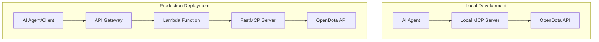

# FastMCP OpenDota Server

> **Showcase Project**: This is a demonstration project showing how to transform an OpenAPI REST API into an MCP server using FastMCP. See the accompanying blog post for architectural insights and best practices.

A Model Context Protocol (MCP) server that wraps the OpenDota API using FastMCP, deployable both locally and as a remote API via AWS Lambda + API Gateway.

## 🏗️ Architecture

This is a **monorepo** with dual deployment modes:
- **Local MCP Server**: Direct `streamable-http` transport for local AI agents
- **Remote API**: AWS Lambda + API Gateway deployment with response streaming

### Key Technologies
- **[FastMCP](https://gofastmcp.com)**: Auto-generates MCP tools from OpenAPI specifications
- **AWS Lambda Powertools**: Robust API Gateway integration with streaming support
- **UV**: Modern Python package manager with Lambda deployment optimizations
- **AWS CDK**: Infrastructure as code with TypeScript

## 🚀 Quick Start

### Prerequisites
- Node.js 18+ and npm
- Python 3.12+ and [UV](https://docs.astral.sh/uv/)
- AWS CLI configured (for deployment)
- Docker (for CDK Lambda bundling)

### Install Dependencies
```bash
npm run install:deps
```

### Local Development
```bash
npm run dev:local
```

The server will start at `http://127.0.0.1:8000/mcp` with the FastMCP interface.

### AWS Deployment
```bash
npm run deploy
```

## 📁 Project Structure

```
├── bin/                    # CDK app entry point
├── lib/                    # CDK stack definitions
├── python-lambda/          # Python MCP server code
│   ├── lambda_function.py # AWS Lambda handler
│   ├── pyproject.toml     # Python dependencies
│   └── uv.lock           # Locked dependencies
├── cdk.json              # CDK configuration
├── package.json          # Node.js dependencies
├── DEPLOYMENT.md         # Detailed deployment guide
└── README.md            # This file
```

## 🔧 Development Commands

| Command | Description |
|---------|-------------|
| `npm run dev:local` | Start local MCP server |
| `npm run build` | Build TypeScript CDK code |
| `npm run deploy` | Deploy to AWS Lambda + API Gateway |
| `npm run deploy:hotswap` | Fast deployment for Lambda code changes |
| `npm run diff` | Preview AWS infrastructure changes |

## 🌐 Usage Examples

### Local AI Agent Integration

Add to your AI agent's MCP configuration:

```json
{
  "mcpServers": {
    "opendota": {
      "command": "uvx",
      "args": ["--from", "git+https://github.com/your-username/fastmcp-opendota", "fastmcp-opendota"],
      "env": {}
    }
  }
}
```

### Remote API Usage

After deployment, use the API Gateway endpoint:

```bash
# Your deployed API Gateway URL
export MCP_API_URL="https://your-api-gateway-url.execute-api.region.amazonaws.com/prod"

# List available MCP tools
curl -X POST "$MCP_API_URL/tools/list" \
  -H "Content-Type: application/json" \
  -d '{}'

# Call a tool (example: get player data)
curl -X POST "$MCP_API_URL/tools/call" \
  -H "Content-Type: application/json" \
  -d '{
    "name": "get_player_data",
    "arguments": {"account_id": "123456789"}
  }'

# Health check
curl -X GET "$MCP_API_URL/health"
```

## 🎮 Available OpenDota Tools

The server exposes the entire OpenDota API as MCP tools:

- **Player Data**: `get_player_data`, `get_player_matches`, `get_player_heroes`
- **Match Data**: `get_match_details`, `get_recent_matches`
- **Hero Statistics**: `get_hero_stats`, `get_hero_matchups`
- **Professional Scene**: `get_pro_matches`, `get_pro_players`, `get_teams`
- **Game Metadata**: `get_heroes`, `get_items`, `get_game_modes`

All tools include automatic parameter validation and comprehensive documentation.

## 🔑 Key Features

### Authentication Removal
- **NoAuthClient**: Strips authentication from OpenDota API calls
- **Spec Cleaning**: Removes security schemes from OpenAPI specification
- **Public Access**: Works with OpenDota's public, rate-limited endpoints

### Dual Deployment Architecture


### AWS Lambda Optimizations
- **Response Streaming**: Supports streaming responses for large datasets
- **UV Bundling**: Efficient dependency packaging for Lambda
- **Platform-Specific**: x86_64-linux optimized packages
- **Cold Start Optimization**: Lightweight runtime with minimal dependencies

## 🧪 Testing

### Local Testing
```bash
# Test Python environment
cd python-lambda && uv run python -c "import fastmcp; print('✓ Ready')"

# Test Lambda handler
cd python-lambda && uv run python -c "from lambda_function import lambda_handler; print('✓ Handler OK')"
```

### Infrastructure Testing
```bash
# Preview changes before deployment
npm run diff

# Deploy to test environment
AWS_PROFILE=test npm run deploy
```

## 📊 Performance

- **Local Server**: ~50ms response time, direct HTTP transport
- **Lambda Cold Start**: ~1-2s for first request
- **Lambda Warm**: ~100ms response time
- **API Gateway**: Streaming support for large responses
- **Rate Limits**: Inherits OpenDota's public API limits (no auth required)

## 🔧 Troubleshooting

### Common Issues

**CDK Deployment Fails**
```bash
# Check AWS credentials
aws sts get-caller-identity

# Bootstrap CDK (first time)
npx cdk bootstrap

# Clean and retry
rm -rf cdk.out && npm run deploy
```

**Local Server Won't Start**
```bash
# Check UV installation
uv --version

# Sync dependencies
cd python-lambda && uv sync

# Test OpenDota API access
curl https://api.opendota.com/api
```

**Lambda Bundling Issues**
```bash
# Manual packaging
npm run package:lambda

# Check Docker
docker --version
```

See [DEPLOYMENT.md](DEPLOYMENT.md) for comprehensive troubleshooting.

## 📈 Roadmap

This is a showcase project with limited maintenance. Potential extensions:
- Caching layer (Redis)
- WebSocket support for real-time updates
- GraphQL integration
- Docker deployment alternative
- Monitoring dashboards

## 🤝 Contributing

This is a showcase/demonstration project. If you'd like to adapt it for your own use:

1. Fork the repository
2. Create a feature branch: `git checkout -b feature/your-feature`
3. Test locally: `npm run dev:local`
4. Test deployment: `npm run diff`
5. Submit a pull request

See [CONTRIBUTING.md](CONTRIBUTING.md) for more details.

## 📄 License

This project is licensed under the MIT License - see the [LICENSE](LICENSE) file for details.

## 🙏 Acknowledgments

- **[OpenDota](https://www.opendota.com/)**: Providing free Dota 2 statistics API
- **[FastMCP](https://gofastmcp.com)**: Powerful MCP server framework
- **[AWS Lambda Powertools](https://awslabs.github.io/aws-lambda-powertools-python/)**: Robust Lambda utilities
- **[UV](https://docs.astral.sh/uv/)**: Next-generation Python package management

---

## 📞 Support

- 📖 **Documentation**: See [DEPLOYMENT.md](DEPLOYMENT.md) for detailed setup
- 🐛 **Issues**: [GitHub Issues](https://github.com/your-username/fastmcp-opendota/issues)
- 💬 **Discussions**: [GitHub Discussions](https://github.com/your-username/fastmcp-opendota/discussions)
- 🌐 **FastMCP Community**: [FastMCP Discord](https://discord.gg/fastmcp)

---

**Built with ❤️ for the Dota 2 and AI communities**
